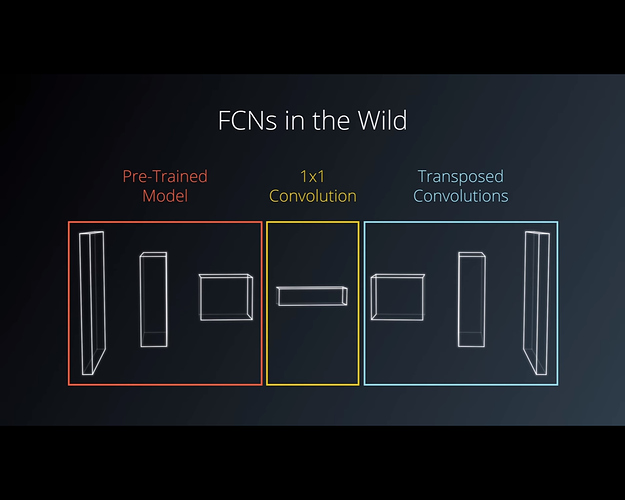
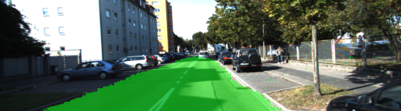
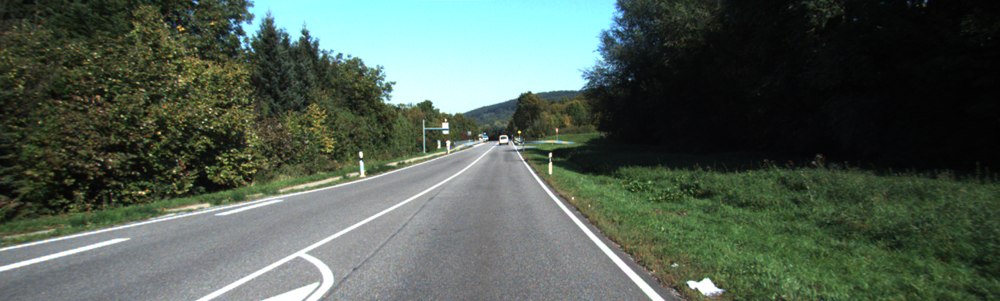
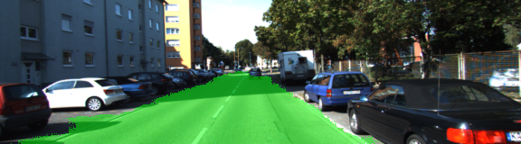
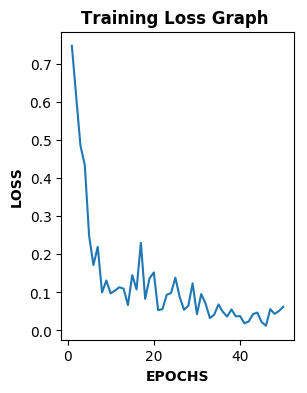

# Semantic Segmentation
### Introduction:
In this project, a Fully Convolutional Network (FCN) is used to label the pixels of a road in images.

### Fully Convolutional Network (FCN):
An FCN was used in this project because it retains the spatial information during training. This can be really helpful when trying to identify where an object is in an image. The architecture used in this project is divided into three main parts as shown in the architecture below:

* Encoder: Pre-trained VGG16 neural network
* 1 x 1 convolution
* Decoder: Transposed convolutions and skip connections

### Why do we need 1x1 convolution?
The main purpose of the 1x1 convolutions that we are adding on top of the VGG is merely to reduce the number of filters from 4096 to whatever the number of classes for our model is and we did that for each layers.

### Different Layers:
Below are the different and their shape.

* resample vgg_layer7_out by 1x1 Convolution: To go from ?x5x18x4096 to ?x5x18x2
* upsample vgg_layer7_out_resampled: by factor of 2 in order to go from ?x5x18x2 to ?x10x36x2
* resample vgg_layer4_out out by 1x1 Convolution: To go from ?x10x36x512 to ?x10x36x2
* combined_layer1 = tf.add(vgg_layer7, vgg_layer4)
* fcn_layer2: upsample combined_layer1 by factor of 2 in order to go from ?x10x36x2 to ?x20x72x2
* resample vgg_layer3_out out by 1x1 Convolution: To go from ?x20x72x256 to ?x20x72x2
* combined_layer2 = tf.add(vgg_layer3, fcn_layer2)
* upsample combined_layer2 by factor of 8 in order to go from ?x20x72x2 to ?x160x576x2

### Hyper-parameters:

Below are the different hyper parameter experimented tuned to get optimum result.

| Parameter | Value |
| --- | --- |
| Keep Probability | .65 |
| Batch Size | 16 |
| Epochs | 50|
| Learning Rate | .0001 |
| Normalization Standard Deviation | .01|

### Results:
Below are the images before and after inferencing.

| images before| after inferencing |
| --- | --- |
| | |
|  |  |

### Loss Vs epcohs graph
Below is how loss vs epochs graph looks like.

### Future Scope
Though the models works reasonably well but below are few things which I need to work upon.
* Data set augmentation to improve the accuracy
* Improving the inferencing efficiency.
* Experimenting with some other model than VGG16 and comparing the accuracy.
